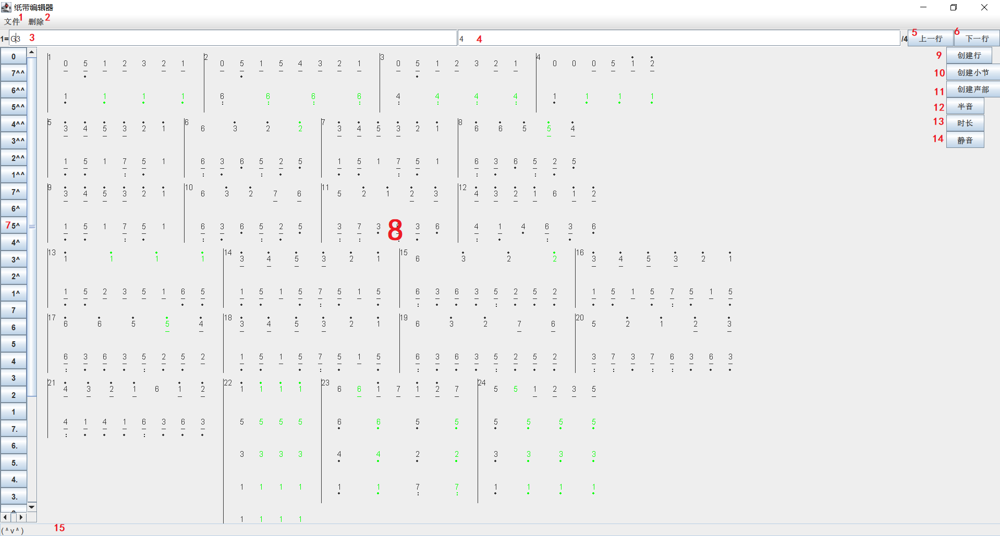

# 简介

八音盒纸带编辑器是与[八音盒纸带生成器](https://github.com/Louis-Nicolas-Davout/MusicBoxTapeGenerator)配套的项目，旨在简化xml文件的编写工作，如图所示。  

// 如果无法正常显示图片，尝试直接下载pic0.png。  

在demo目录中有一个编写好的序列化文件：雪之梦_Bandari.tape.ser，用作示例。  

# 概念

## 调号

乐谱中中音1的绝对音高，相当于[八音盒纸带生成器](https://github.com/Louis-Nicolas-Davout/MusicBoxTapeGenerator)中的lnd:musical_score节点的musical_tone属性。  

## 拍号

在本项目中，拍号特指每一小节的时长与四分音符时长的比值，相当于[八音盒纸带生成器](https://github.com/Louis-Nicolas-Davout/MusicBoxTapeGenerator)中的lnd:musical_score节点的bar_duration属性。  

## 行

在[八音盒纸带生成器](https://github.com/Louis-Nicolas-Davout/MusicBoxTapeGenerator)的xml文件中没有“行”的概念，乐谱由各个小节直接组成。但在纸带编辑器中，为了方便显示，小节首先组成行，再由行组成乐谱。  

## 小节

在纸带编辑器中，每一个小节与[八音盒纸带生成器](https://github.com/Louis-Nicolas-Davout/MusicBoxTapeGenerator)中的lnd:musical_bar节点一一对应。  

## 声部

在本项目中，“声部”的概念其实更接近于音轨。一个小节可以有一个或多个声部，同一首音乐的不同小节可以有不同数目的声部。  

## 文件名

为了避免产生新的扩展名，同时保证辨别与纸带相关的的特殊文件，纸带编辑器使用一种“双扩展名”，即在文件名的末尾增加一段".tape"，与文件的实际扩展名组合为形如".tape.ser"或".tape.xml"的结尾。在选择文件时，选择窗口将在“文件类型”下拉菜单中提供只显示这些文件的选项（这个选项通常是默认的），以及显示所有文件和目录的“所有文件”选项。  

# 使用方法

## “文件”菜单

位于图中1处。  

与文件有关的功能位于此菜单内。  

### “从文件中解序列化”选项

从一个.tape.ser文件中读取乐谱。  

### “保存为文本”选项

将当前乐谱保存为可供在[八音盒纸带生成器](https://github.com/Louis-Nicolas-Davout/MusicBoxTapeGenerator)读取的.tape.xml文件，强烈建议在保存xml的同时也保存一份序列化文件，因为将乐谱转换为xml的操作是不可逆的。纸带编辑器无法加载以xml形式存在的乐谱。  

### “保存为序列化对象”选项

将当前乐谱保存为.tape.ser文件。  

## “删除”菜单

位于图中2处。  

与删除相关的操作位于删除菜单中，这种设计是为了避免误删除操作，因为目前的纸带编辑器不提供撤销功能。  

### “删除行”选项

如果乐谱中有不止一行，则删除选中音符或小节线所在的行。  

### “删除小节”选项

如果行中有不止一个小节，则删除选中音符或小节线所在的小节。  

### “删除声部”选项

如果小节中有不止一个声部，则删除选中音符所在的声部。  

### “删除音符”选项

删除选中的音符。  

## 调号输入框

位于图中3处。  

设置导出.tape.xml文件的调号(musical_tone属性)，默认C3。  

注意调号信息并不存入序列化文件中，因此每次打开都需要重新设置。  

同时，如果输入了不支持的调号，.tape.xml文件仍能正常导出，但[八音盒纸带生成器](https://github.com/Louis-Nicolas-Davout/MusicBoxTapeGenerator)将会报错。  

## 拍号输入框

位于图中4处。  

设置导出.tape.xml文件的拍号(bar_duration属性)，默认4，代表4/4拍，即一个小节占四个四分音符的时长。  

注意拍号信息并不存入序列化文件中，因此每次打开都需要重新设置。  

如果输入了非数字字符串，.tape.xml文件仍能正常导出，但[八音盒纸带生成器](https://github.com/Louis-Nicolas-Davout/MusicBoxTapeGenerator)将会报错。  

## “上一行”按钮

位于图中5处。  

将窗口的显示区域上移一行，适用于乐谱太长无法一次性全部显示的情况。  

## “下一行”按钮

位于图中6处。  

将窗口的显示区域下移一行，适用于乐谱太长无法一次性全部显示的情况。  

## 音符输入面板

位于图中7处。  

未选中任何音符或小节线，在整首音乐末尾添加音符；  

选中小节线，在该小节第一个空的声部或最后一个声部末尾添加音符；  

选中音符，在选中音符的后方添加音符。  

## 乐谱显示面板

位于图中8处。  

用于显示当前乐谱。支持鼠标点选小节线或音符，或者点击没有小节的区域以取消选中。  

## “创建行”按钮

位于图中9处。  

未选中任何音符或小节线，在整首音乐末尾添加新行；  

否则在选中音符或小节线所在行上方添加新行。  

## “创建小节”按钮

位于图中10处。  

未选中任何音符或小节线，在整首音乐末尾添加新小节；  

选中小节线，在该小节前方添加新小节；  

选中音符，在所在小节的后方添加新小节。  

## “创建声部”按钮

位于图中11处。  

未选中任何音符或小节线，在整首音乐末尾添加新声部；  

选中小节线，在该小节开始处添加新声部；  

选中音符，在所在声部的下方添加新声部。  

## “半音”按钮

位于图中12处。  

未选中任何音符或小节线，该变末尾音符半音；  

选中音符，改变选中音符半音。  

如果选中音符或末尾音符无法升半音，则什么也不做。  

## “时长”按钮

位于图中13处。  

未选中任何音符或小节线，该变末尾音符时长；  

选中音符，改变选中音符时长。  

仅仅支持四种时长：十六分音符、八分音符、附点八分音符和四分音符，单击时长按钮时会在四种时长间依序切换，并根据时长更新下划线与附点的显示。  

## “静音”按钮

位于图中14处。  

未选中任何音符或小节线，该变末尾音符静音选项；  

选中音符，改变选中音符静音选项。  

静音的音符在导出为.tape.xml文件时转换为休止符，从而不发出声音。  

由于八音盒没有发音时间长短的概念，静音音符在结果上相当于延长了前面音符，从而取代了连音线的功能。  

## 提示栏

位于图中15处。  

当程序中发生设计范围内的异常时，会在提示栏中显示简化版本的异常信息。如果异常信息出现在控制台中，说明此项目中含有尚未被发现的设计缺陷。  

